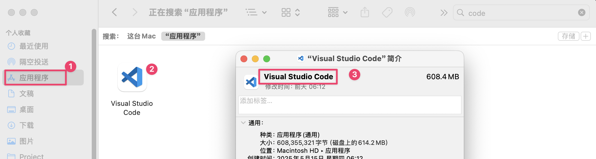

# Welcome

本文主要做笔记，记录鼠须管的 app_options 配置，内容要有两点：

+ 如何获取APP标识
+ 配置 app_options

演示环境:

+ macOS Sequoia 15.5
+ Squirrel 1.0.3

## 1. 获取APP标识

> 通过两步获取
>
> 1. 获取 APP 名称
> 2. 通过终端命令获取 APP 标识

### 1.1 APP 名称获取

1. 打开“访达”中的 Applications，找到想要设置的应用。
2. 鼠标选中后右键-显示简介（快捷键 Command + i）
3. 获取弹窗顶部的应用名称（我们要用的）



### 1.2 获取 APP 标识

首先打开你的任意终端程序，系统自带默认终端(Terminal)。
然后将获取到的 APP 名称放入到下方命令模板中获取APP标识。

```shell
# 命令模板
osascript -e 'id of app "应用名称"'
```

==⚠️<b>注意：</b>一定只替换“应用名称”，记得携带好上引号！==

<b>示例：</b>获取 VS Code 的 APP 标识

```shell
osascript -e 'id of app "Visual Studio Code"'
com.microsoft.VSCode
```


## 2. 配置到鼠须管配置文件中

+ 打开配置文件 Squirrel.yaml


+ 找到 app_options，然后配置好


+ 鼠须管-重新部署，使其生效

